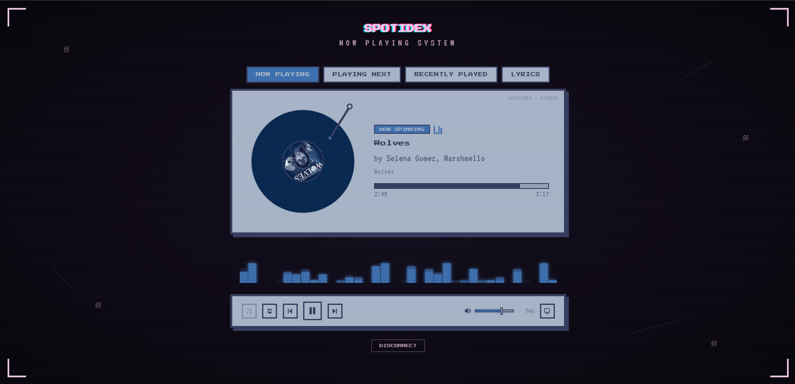
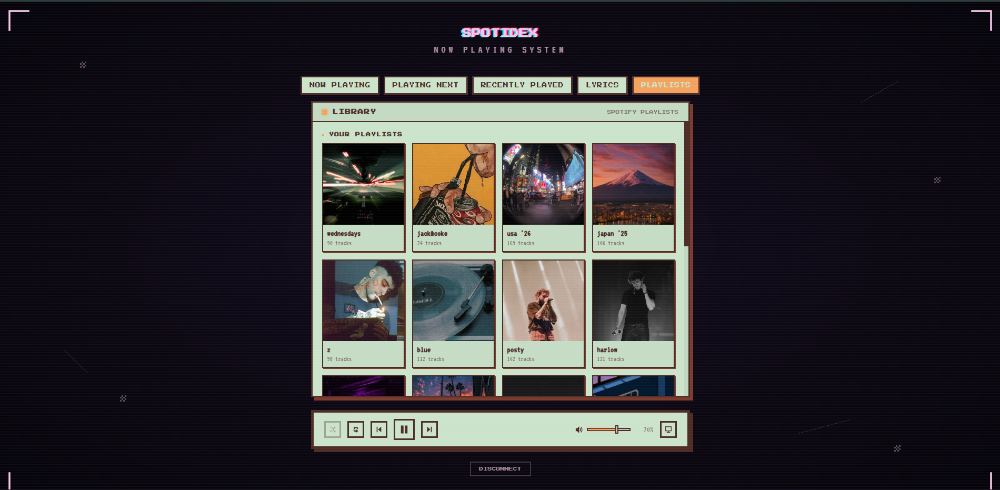
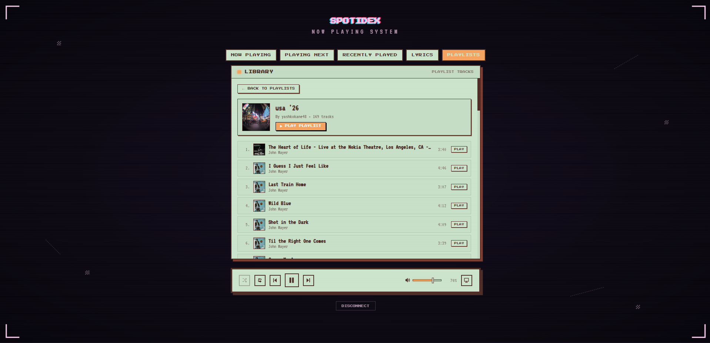
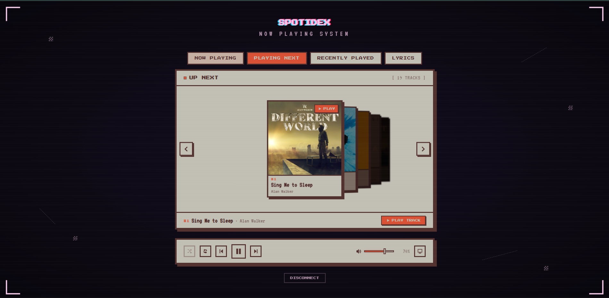
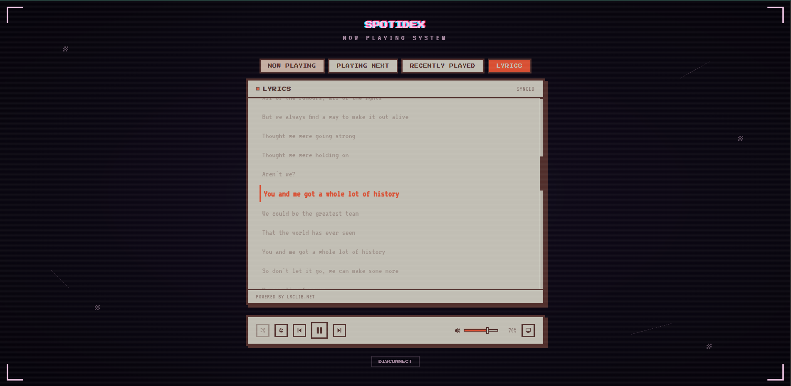
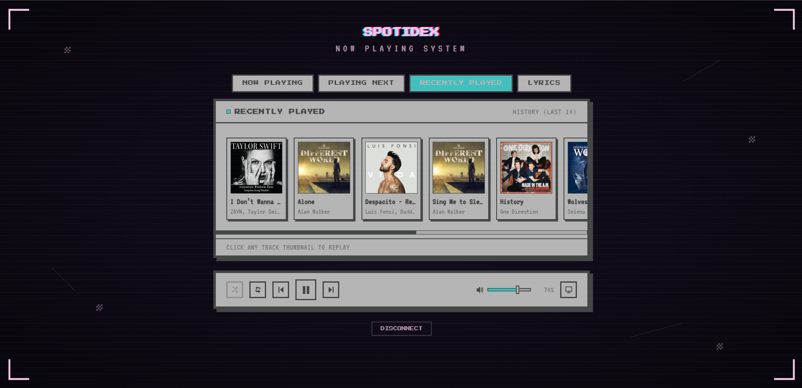

# 💽 SpotiDex

<div align="center">

```
  ███████╗██████╗  ██████╗ ████████╗██╗██████╗ ███████╗██╗  ██╗
  ██╔════╝██╔══██╗██╔═══██╗╚══██╔══╝██║██╔══██╗██╔════╝╚██╗██╔╝
  ███████╗██████╔╝██║   ██║   ██║   ██║██║  ██║█████╗   ╚███╔╝ 
  ╚════██║██╔═══╝ ██║   ██║   ██║   ██║██║  ██║██╔══╝   ██╔██╗ 
  ███████║██║     ╚██████╔╝   ██║   ██║██████╔╝███████╗██╔╝ ██╗
  ╚══════╝╚═╝      ╚═════╝    ╚═╝   ╚═╝╚═════╝ ╚══════╝╚═╝  ╚═╝
```

### *A retro hi-fi pixel-art Spotify companion with dynamic album-art theming.*

[](https://vitejs.dev/)
[](https://react.dev/)
[](https://developer.spotify.com/)
[](https://web.dev/progressive-web-apps/)
[](https://opensource.org/licenses/MIT)

[Features](#-what-makes-spotidex-different) • [Screenshots](#-screenshots--vibe-check) • [Quickstart](#-getting-started) • [PWA Install](#-progressive-web-app-pwa) • [OBS Overlay](#-obs-studio-overlay-mode) • [Keyboard Shortcuts](#-keyboard-shortcuts) • [Known Limitations](#-real-talk-known-limitations)

</div>

---

## 📻 Why SpotiDex?

Modern streaming apps are convenient, but they're sterile. Flat gray rectangles, infinite scrolling menus, and zero tactile soul.

**SpotiDex** turns your Spotify session into a nostalgic desktop shrine:
- A turntable that actually spins with your music.
- A mechanical tonearm that lifts, drops, and returns with track changes.
- Vinyl records you can grab and flick across the screen to skip songs.
- Dynamic color alchemy that bathes your display in the hues of whatever album is spinning—with automated WCAG contrast correction so it never becomes an illegible neon mess.
- An animated, deterministic 36-bar LED audio visualizer.
- A 3D perspective queue carousel with 1-click card play.
- Real-time karaoke lyrics synchronized to playback.
- A dedicated Playlists & Library explorer with context playback.
- Installable as a standalone offline-shielded Progressive Web App (PWA).
- A transparent, zero-overhead HUD mode built specifically for OBS streamers.

No servers, no hidden backends, and no proprietary lock-in. Just pure client-side React and PKCE OAuth running straight from your browser or desktop app frame.

---

## 📸 Screenshots & Vibe Check

<div align="center">

### 💽 Now Playing — Turntable, Tonearm & Deterministic Visualizer
*Real-time spinning vinyl with album center label, animated needle drop, dynamic album chromotherapy, and 36-band equalizer.*



<br/><br/>

### 📚 Playlists & Library Explorer

| 🗂️ Playlists Grid | 🎵 Tracklist & Context Player |
|:---:|:---:|
|  |  |
| *Browse your created and followed playlists in a retro folder grid* | *Inspect song details, durations, and start 1-click playlist context playback* |

<br/>

### 🎠 3D Depth Queue Carousel & 🎤 Synced Karaoke Lyrics

| 🎠 3D Depth Queue Carousel | 🎤 Synced Karaoke Lyrics |
|:---:|:---:|
|  |  |
| *Browse upcoming queue in an interactive 3D cylinder with direct click-to-play* | *Real-time line-by-line synced lyrics highlighting powered by LRCLIB* |

<br/>

### 📜 Persistent Session Audio Log



*Session playback log saved to local storage with 1-click replay.*

</div>

---

## ✨ What Makes SpotiDex Different?

### 💽 Tactile Vinyl Deck & Needle-Drop Physics
- **Realistic Needle Dynamics**: The tonearm smoothly pivots away when playback pauses and drops into the groove when music begins. Changing tracks triggers a synchronized needle lift-and-drop animation.
- **Drag-to-Skip Gesture Physics**: Don't just click buttons—click and drag the spinning vinyl record itself. Pull with spring resistance; fling it past the threshold to slide it off-screen and trigger an instant skip, or let go to watch it snap back.

### 🎨 Chromotherapy: Dynamic Album Palette Extraction
- Powered by `node-vibrant`, SpotiDex samples the dominant colors from your current album art in real-time and injects them into custom CSS properties (`--ink`, `--ink-deep`, `--accent`, `--card`).
- **WCAG AA Contrast Safeguards**: Unlike naive color pickers that often produce unreadable text, SpotiDex calculates luminance contrast ratios on the fly. If an album produces low contrast, the engine shifts lightness and saturation until it guarantees a minimum **4.5:1 contrast ratio**.

### 📊 36-Band Deterministic Audio Visualizer
- Spotify's Web API does not stream raw PCM audio bytes to third-party web apps. Instead of faking it with jittery random noise, SpotiDex uses a **Mulberry32 PRNG seeded by the unique Spotify Track ID**.
- Every song generates its own distinct, reproducible 36-bar harmonic rhythm pattern across 8 discrete LED levels. When paused, the visualizer gracefully settles down to an ambient standby baseline.

### 🎠 3D Perspective Queue Carousel (With Click-to-Play)
- Switch over to the **PLAYING NEXT** tab to browse upcoming songs arranged in an interactive 3D cylinder powered by **GSAP**.
- Scroll with your trackpad/mouse wheel or drag horizontally to browse. Click **any song card** to jump directly to that track—equipped with smooth hover play indicators and drag cancellation so browsing is never confused with playing.

### 📚 Interactive Playlists & Library Hub
- Explore your Spotify collection inside the retro pixel interface via the **PLAYLISTS** tab.
- Automatically organizes your playlists into **YOUR PLAYLISTS** and **FOLLOWED PLAYLISTS**.
- Drill into any playlist to inspect track names, artists, durations, and album thumbnails.
- Start full playlist context playback with **1 click** (`▶ PLAY PLAYLIST`) or jump straight to any specific track in the list.

### 🎤 Synchronized Karaoke Lyrics
- Live line-by-line synchronized lyrics powered by the community-maintained [LRCLIB](https://lrclib.net/) database.
- Uses a local 250ms interpolation clock so lyrics highlight and auto-scroll smoothly between Spotify's 3-second polling cycles. Gracefully falls back to unsynced plain text or instrumental tags when timestamps aren't available.

### 📜 Local "Audio Dex" History Log
- Spotify's recent history endpoint is notorious for 403 errors and caching issues on developer apps. SpotiDex sidesteps this by maintaining a local, persistent listening log in `localStorage` (capped at 50 tracks).
- Relive your session history and click any past track to re-cue it instantly (automatically toggling off shuffle so your selection plays immediately).

### 📱 Standalone Progressive Web App (PWA)
- Install SpotiDex as a standalone app directly to your desktop or mobile home screen.
- Features custom pixel icons, standalone display mode, and background theme synchronization.
- **Smart Update Protection**: Uses a prompt-based update toast so updates never interrupt or reload an active music session mid-song.
- **Live-Data Caching Protection**: The Service Worker precaches the retro UI shell while enforcing strict network bypasses on Spotify and LRCLIB APIs, ensuring your telemetry is always live.

---

## 🕹️ Keyboard Shortcuts

Take control without ever taking your hands off the keyboard:

| Key | Action |
|:---|:---|
| <kbd>Space</kbd> | Toggle Play / Pause |
| <kbd>→</kbd> (Right Arrow) | Skip to Next Track |
| <kbd>←</kbd> (Left Arrow) | Skip to Previous Track |
| <kbd>↑</kbd> (Up Arrow) | Volume +5% |
| <kbd>↓</kbd> (Down Arrow) | Volume -5% |

*(Shortcuts are automatically disabled when typing in inputs or dialogs).*

---

## 🛠️ Tech Stack & Architecture

- **Core**: [React 19](https://react.dev/) + [Vite](https://vitejs.dev/) (lightning-fast HMR and minimal bundle footprint)
- **Spotify Auth**: Client-side **OAuth 2.0 PKCE** (Proof Key for Code Exchange). Zero backend servers required. No secrets baked into frontend code.
- **Progressive Web App**: `vite-plugin-pwa` with Workbox precaching, custom manifest, and network-only telemetry caching.
- **Animation & 3D Math**: [GSAP](https://greensock.com/gsap/) for smooth 3D stage depth rendering, drag resistance, and carousel transforms.
- **Palette Extraction**: [`node-vibrant/browser`](https://github.com/Vibrant-Colors/node-vibrant) with custom luminance math and contrast clamping.
- **Lyrics Engine**: [LRCLIB](https://lrclib.net/) REST API with timestamp parser and fuzzy search fallback.
- **State & Performance**:
  - 3-second smart Spotify API poll interval with automatic token refresh on 401.
  - 250ms sub-ticker for buttery-smooth progress bar movement and lyrics sync.
  - Page Visibility API integration to pause network and animation timers when the browser tab is hidden.

---

## 🚀 Getting Started

You will need a standard (free or premium) Spotify account and 3 minutes to set up a developer credential.

### 1. Register a Spotify Developer App
1. Go to the [Spotify Developer Dashboard](https://developer.spotify.com/dashboard) and log in.
2. Click **Create app**.
3. Fill out the basic details:
   - **App name**: `SpotiDex`
   - **App description**: `My retro pixel vinyl companion`
   - **Redirect URI**: `http://127.0.0.1:5173/callback`
   > ⚠️ **CRITICAL**: Spotify's redirect URI validator is exact. You **MUST** use `http://127.0.0.1:5173/callback` (NOT `localhost`).
4. Select **Web API** under the APIs section and accept the Developer Terms.
5. In your new app's **Settings**, copy the **Client ID**.

### 2. Clone & Configure
```bash
# Clone the repository
git clone https://github.com/yashkokane1031/SpotiDex.git
cd SpotiDex

# Copy the environment template
cp .env.example .env
```

Open `.env` in your text editor and paste your Spotify Client ID:
```env
VITE_SPOTIFY_CLIENT_ID=your_spotify_client_id_here
VITE_REDIRECT_URI=http://127.0.0.1:5173/callback
```

### 3. Install & Launch
```bash
# Install dependencies
npm install

# Start the local development server
npm run dev
```

Open **`http://127.0.0.1:5173`** in your browser, click **CONNECT SPOTIFY**, and spin your first record!

---

## 📱 Progressive Web App (PWA)

SpotiDex can be installed directly as a standalone app on macOS, Windows, Linux, Android, and iOS:
- **Chrome / Edge / Brave**: Click the install icon in the URL bar or select **Install SpotiDex** from the browser menu.
- **iOS / Safari**: Tap **Share** > **Add to Home Screen**.
- Includes an offline fallback screen with retro pixel visuals and a manual retry button.
- Clean update toast alerts you when a new release is built without forcing mid-track reloads.

---

## 📺 OBS Studio Overlay Mode

SpotiDex comes with a first-class stream overlay mode that strips away page margins, headers, and backgrounds—giving you a 100% transparent pixel-art deck that floats cleanly over gameplay or webcam scenes.

### ⚠️ Prerequisite: Authenticate Once in Your Browser
> **OBS Studio's built-in CEF browser does not support OAuth popups or complex auth redirect loops.**
> 
> Simply open `http://127.0.0.1:5173` in your normal web browser (Chrome, Edge, Firefox, Brave) and connect Spotify once. SpotiDex stores your token in browser storage on your machine.

### Adding SpotiDex to OBS
1. In OBS Studio, locate the **Sources** dock, click **`+`**, and choose **Browser**.
2. Name the source (e.g. `SpotiDex Deck`).
3. Set the **URL** to:
   ```
   http://127.0.0.1:5173/?obs=true
   ```
4. Set dimensions:
   - **Width**: `760` (or `800`)
   - **Height**: `400`
5. Ensure OBS's default Custom CSS remains:
   ```css
   body { background-color: rgba(0, 0, 0, 0); margin: 0px auto; overflow: hidden; }
   ```
6. Click **OK**!

### Overlay URL Tweaks
- **Clean Passive Display (Vinyl + Visualizer)**:
  ```
  http://127.0.0.1:5173/?obs=true
  ```
- **Streamer Deck with Transport Controls**:
  ```
  http://127.0.0.1:5173/?obs=true&controls=true
  ```

---

## 💡 Real Talk: Known Limitations

We believe in being 100% upfront about platform boundaries rather than hiding bugs behind vague excuses:

1. **No "Save to Liked Songs" (Heart) Button**:
   - Spotify restructured their Developer Platform policies: any endpoint that modifies a user's library (`user-library-modify`) now requires enterprise-level *Extended Quota* approval with commercial agreements. Since personal open-source apps cannot qualify, this feature was completely removed rather than left as a broken, failing button.
2. **Local-Only Listening History**:
   - Spotify's official `/me/player/recently-played` endpoint frequently returns 403 Forbidden on developer apps and is slow to refresh. To guarantee reliability, SpotiDex maintains its history locally in your browser's `localStorage`. This means history is logged while SpotiDex is running.
3. **Lyrics Completeness**:
   - Lyrics are fetched from the crowd-powered [LRCLIB](https://lrclib.net/) database. While coverage for popular releases is fantastic, obscure underground b-sides, indie demos, or instrumental interludes may not have synced lines available.
4. **Spotify Premium Required for Full Playback Control**:
   - Due to Spotify's Web API architecture, playback commands (play, pause, skip, seek, transfer device, and playlist playback) require an active **Spotify Premium** account. Free tier accounts can only read currently playing metadata.

---

## 🤝 Contributing

Got an idea for a retro skin, an oscilloscope mode, or a new vinyl texture? Pull requests and issues are welcome!

```bash
# Run the ultra-fast linter
npm run lint

# Check production build
npm run build
```

---

## 📄 License

Distributed under the **MIT License**. See [LICENSE](LICENSE) for more information.

<div align="center">
Built with ❤️, pixel art, and lots of coffee by <a href="https://github.com/yashkokane1031">Yash Kokane</a>.
</div>
